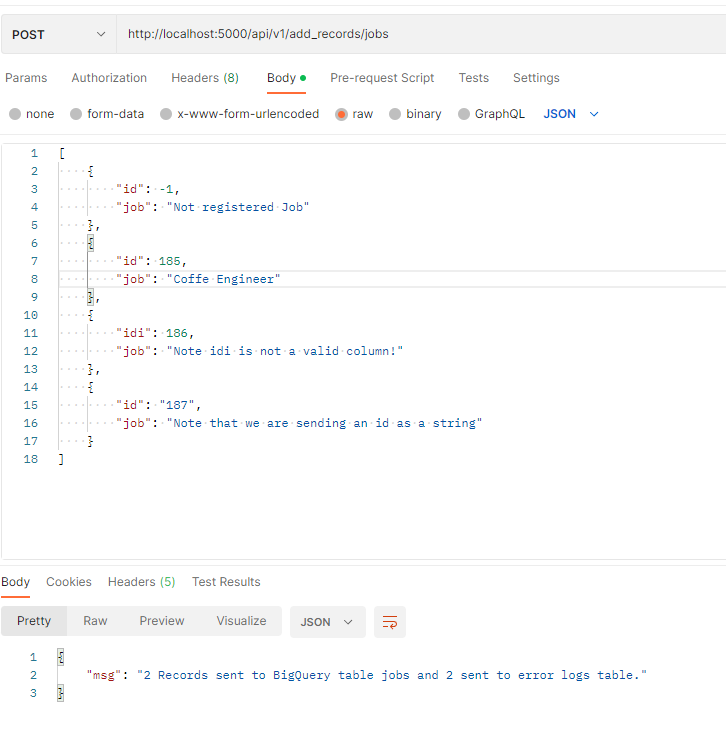
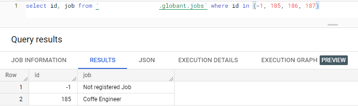
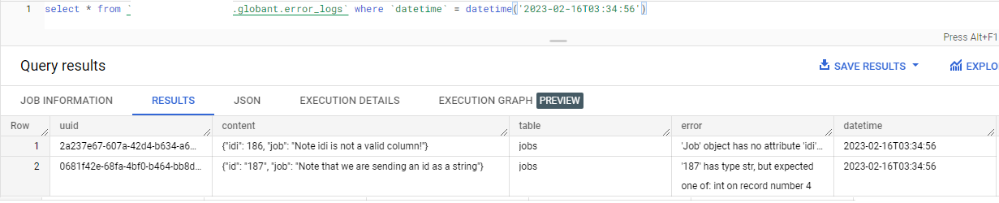
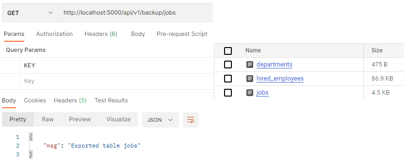
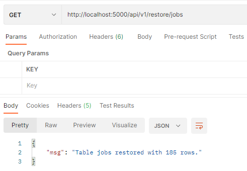

# Globant Data Engineering Test

This are files for the Globant Data Engineering coding challenge by Alejandro Rojas Benitez.

## Challenge 1: Managing a SQL Analytics Database and creating an API for sending new records

The first challenge included 3 different CSV files:
- departments.csv
- jobs.csv
- hired_employees.csv

Which we need to store somewhere and then upload them into a SQL Database of our choice.

For this initial approach I chose saving all the files in a GCS bucket of my own, referenced as $GCP_BUCKET environment variable in this project and for the SQL database I chose BigQuery, this mainly aiming towards analytics on this data. In a real world case, BigQuery would be one of the best tools for analytics purposes and since on this 2nd challenge we have to do some queries and plot them, using a tool created specially for analytics seems like a great choice.

### Loading data to GCS
This part was made using the GCP UI, I created the bucket and then uploaded the files. In a real world scenario, depending if this csv files would keep coming in a daily or weekly basis, this process should definetly be made using a script. But that's usually of the provider's or service owner side.

### Creating BigQuery Database and Tables

We created our database with the name `globant` and all 4 tables on it using the BigQuery web UI. This was a fairly quick and easy process. The tables inside the database are:

- Jobs:

| Column | Type    | Description     |
|--------|---------|-----------------|
|   id   | INTEGER |  Id of the job  |
|   job  | STRING  | Name of the job |

- Departments:

| Column     | Type    | Description            |
|------------|---------|------------------------|
|     id     | INTEGER |  Id of the department  |
| department | STRING  | Name of the department |

- Hired_employees:

| Column        | Type     | Description                                           |
|---------------|----------|-------------------------------------------------------|
|       id      | INTEGER  |                   Id of the employee                  |
|      name     | STRING   |            Name and surname of the employee           |
| datetime      | DATETIME | Hire datetime UTC0 timezone                           |
| department_id | INTEGER  | Id of the department which the employee was hired for |
| job_id        | INTEGER  | Id of the job which the employee was hired for        |

- Error_logs

| Column   | Type     | Description                                                                                                                  |
|----------|----------|------------------------------------------------------------------------------------------------------------------------------|
|   uuid   | STRING   | uuid of the error. This is a unique id asigned to each record that showed an error when trying to append it to target table. |
|  content | STRING   |                                             JSON content that produced the error.                                            |
| table    | STRING   | Target table for the append operation.                                                                                       |
| error    | STRING   | Error message obtained from the `content` field.                                                                             |
| datetime | DATETIME | Datetime of the add data request. UTC0 timezone.                                                                             |

### Ingesting initial data into BigQuery

Both Jobs and Departments tables had a fairly simple schema and contents, so I used the web UI to load the data from GCS to BigQuery. Error logs started as an empty table so there was no work needed here. The last table, Hired Employees needed some data processing with the datetime format. For that we used Apache Beam, the same framework GCP Dataflow service uses.
That code can be seen on this repo under notebooks/Beam Initial data export.ipynb. This code was initially thought to be sent and executed under Dataflow but since it was a one time process I ended just running it in my local machine. But since this is done using Beam, the code should run on Dataflow without many changes.
The 2 main changes done in Beam for Hired Employees were:
- There were some job_id and department_id as null fields, which are foreign keys of the other 2 tables. We changed those null values for -1 and on a later step we will add a new row on each of those tables called `Not registered Job` and `Not registered Department`. This type of changes should go alongside business requierements, so I am supposing the business team requested those field as they were stored in their database, so they can also notice those errors and make the changes on their production database.
-  The csv date format was written on `%Y-%m-%dT%H:%M:%SZ` and BigQuery default format is `%Y-%m-%d %H:%M:%S`. We read the dates using python's datetime library and then changed their format.

### API Development

Then, we had to create an API that enabled us to add new rows to the 3 main tables but also log any wrong records. This API was developed using Python's Flask library.
Users should do a POST request on `api/v1/add_records/<table_name>` where table_name is either: jobs, departments or hired_employees. I'll show some pictures below on adding the `Not registered Job` and `Not registered Department` records. 

The body of the request should follow the actual schema of the tables, and any datetime field should be send as a string using this date format `%Y-%m-%d %H:%M:%S`.

The API answer should show us how many good and bad fields were added into either the target table or the errors log table.

### Parsing the JSON for inserting files

To add the fields into our BigQuery tables we are using BigQuery's storage API. This service needs our messages to be written in a special format called protobuf, which is created by Google and used in many of their services. 

I created a .proto file on this path api/proto_message.proto which states the schema of each of the 4 possibles messages we will be processing in our API.

Protobuf which initially started as a big obstacle in the development of this challenge, ended up super handy! and it is even helping me to parse the request and assert the data type of the payload. 
So we iterate over each on the records that will be inserted and then creating a proto message class with each of its fields. If any field has the wrong format then we will raise an error and separate that record from the others.

At the end, we will have 2 groups: Good and bad records, each of them will be sent either to the target table or to the errors log table. 
Special thanks to [matthieucham] (https://dev.to/stack-labs/13-tricks-for-the-new-bigquery-storage-write-api-in-python-296e) for the detailed guide on how to write records on BigQuery using protobuf and the storage API.

### Example usage of the API

First we will try to add 4 new records into our Jobs table: We have 2 ok fields and 2 wrong fields!

Now, we can see that the api found 2 wrong records. Let's query the Jobs and the error logs table and see if our records are there...

That's how we can add new rows into our tables. On departments we will add just the dummy for not existing departments and we will hire 3 new Coffe Engineers for the company and for our data analysis for later!

### Creating Backups for our tables

This challenge also requested to create a feature to backup our tables in AVRO format. Since we are using a lot of GCP tools, we will store the backups in a GCS bucket and use the BigQuery backup service to create it. 

At the end, to create a backup we just have to use our api and send a GET request on `/api/v1/backup/<table_name>`.

This backup is created using the BigQuery extract table function and inside its job configuration we are stating to save it in AVRO format.

Only 1 backup is created per table and everytime we reload this request, the table's backup will be overwritten with the current data of the table.

### Restoring tables

To restore tables we have to make a GET request on `/api/v1/restore/<table_name>`. This will answer back the number of restored rows. 

The feature is done using BigQuery's load_table_from_uri function, where the uri is the location of the avro file inside our GCS bucket. 

### Dockerfile creation

Finally, I created a Dockerfile so we can create a container of this api service. It is currently being saved in my GCP's container registry but it can be created and loaded locally using the repo's Dockerfile.

## Challenge 2: Data Analysis using GCP Data Studio

For this second challenge we have to do a couple queries in our previously loaded data and plot our findings using our preferred data viz tool. Again, since we are using a lot of GCP services and tools, let's go ahead and use Data Studio since it is easy to use along BigQuery.

### First Query: Number of hirings per department and job for each quarter on 2021

This query is rather hard to analyze, this created a fairly big table with not many hirings per quarter. Still, it can be seen on sql_queries/challenge2-1.sql.

We can see that hirings on Q1 were a lot lower than on the rest, probably some budget issues in the company?

And legal department had the least number of hirings on the entire year and on each quarter, while Support and Engineering were among the top.

### Departments with hirings above the average

With an average of 129.6 hirings per department on 2021, we have the following above it:
- Support
- Engineering
- Services
- Human Resources
- Business Development
- Research and Development
- Marketing

Being them ordered by their number of hirings.

We can see some plots done using looker studio inside the sql_queries/Looker_report.pdf. If you need access to the actual report online please let me know! :)

## Missing plans:

I had a lot of extra ideas to implement in this project but due time restrictions I wasn't able to implement them:

- Cloud run/functions and API Gateway: Deploy the api using either cloud run or cloud functions, then use API Gateway to handle the requests on the API. This aiming towards the security of the service, implementing different authentication methods. 

Right now the only way to authenticate is having and environmental variable called GCP_APPLICATION_CREDENTIALS pointing towards a service account json credentials file inside your local files.

- Extra landing tables for backup: After creating the backup in AVRO format, BigQuery suggests to create an extra landing table to parse any timestamp columns into datetimes for BigQuery, otherwise there may be some issues parsing them and they could be even written in string format, changing the table schema... Not good.